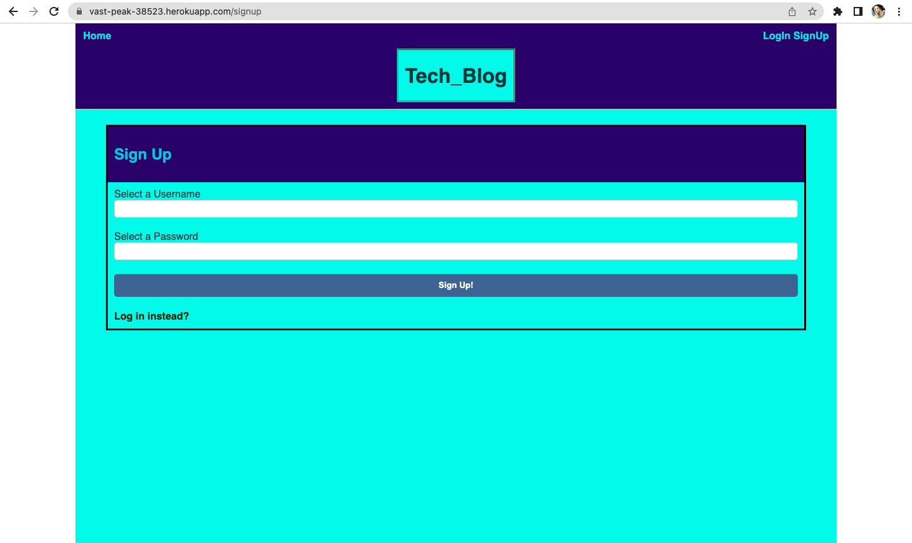
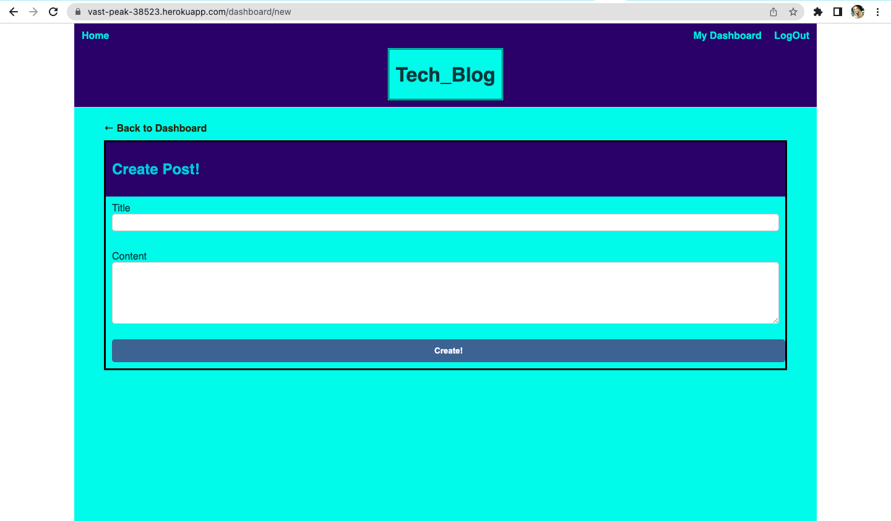
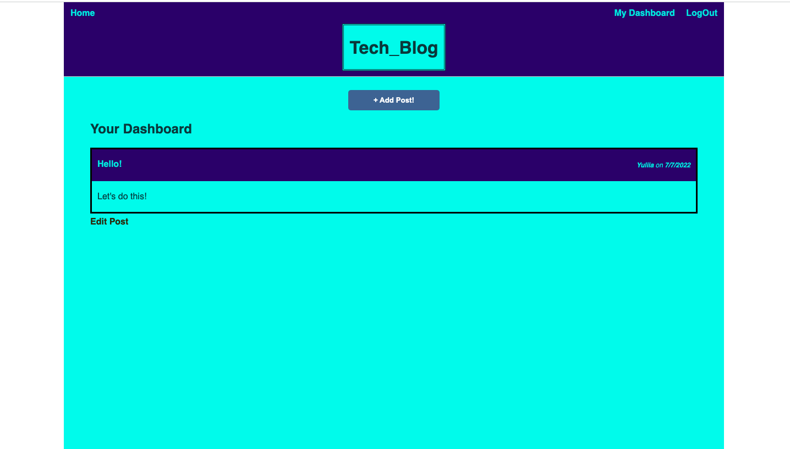
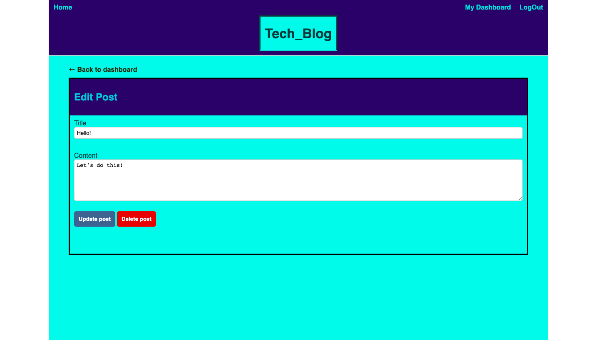

# Tech_Blog
## Description
Web application where developers can publish their blog posts and comment on other developers’ posts as well.

## Screenshot

- Sign Up



- LogIn/Dashboard/Create Post



- Home Page



- Edit & Comment 




## Acceptance Criteria


## Built With
- CSS
- JAVASCRIPT
- HANDLEBARS
- SQL
- NODE.JS
- EXPRESS

## Links
Deployed: https://ymuzhych.github.io/Tech_Blog/
Repo: https://github.com/Ymuzhych/Tech_Blog
Heroku: https://vast-peak-38523.herokuapp.com/ 

- Add a .env file to the root of the app with the following details

```text
DB_NAME = 'tech_blog_db'
DB_USER = 'root'
DB_PW = '******'
DB_SECRET = '******'